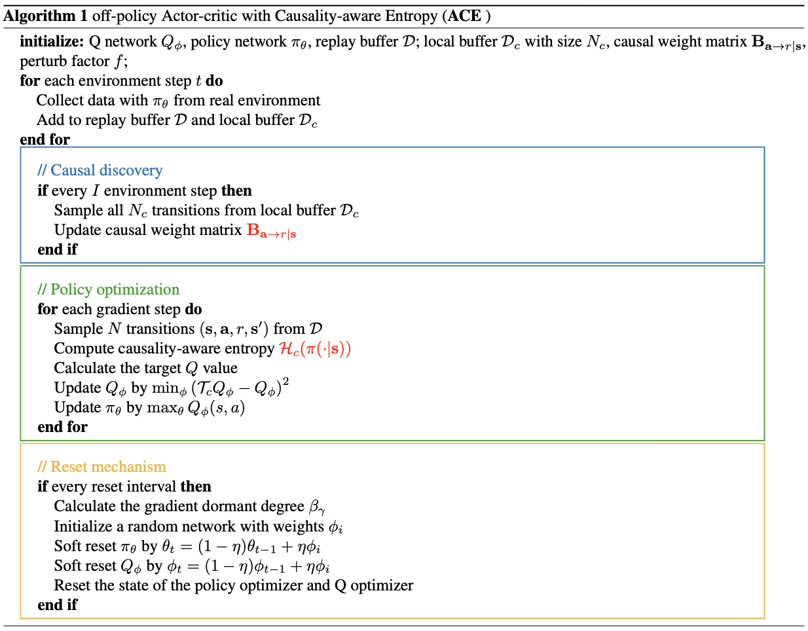

# [ACE: Off-Policy Actor-Critic with Causality-Aware Entropy Regularization](https://arxiv.org/abs/2402.14528)

## 0 Abstract

困难：之前的无模型RL算法忽视了策略学习过程中varying significance of distinct primitive behaviors。

作者的贡献：探索了**不同动作维度与奖励之间的因果关系**，以评估训练过程中各种primitive behaviors的重要性。

方法：

1. 引入一个**causality-aware entropy项**，它能有效识别并优先处理具有高潜在影响的动作，从而实现高效探索
2. 分析**梯度休眠现象**，并引入**休眠引导的重置机制**，以进一步增强方法的性能

## 2 Preliminary

SAC(Soft Actor-Critic) 是一种离策略最大熵DRL算法，其特点是目标函数中包含一个策略熵正则化项，旨在针对每个给定的状态执行更多样化的action，即访问具有更高熵的状态以实现更好的探索：
$$
J(\pi) = \sum_{t=0}^\infty E_{(s_t, a_t)\sim \rho(\pi)}[\gamma^t(r(s_t, a_t) + \alpha \mathcal H(\pi(\cdot\mid s_t)))]
$$

## 3 Off-policy Actor-critic with Causality-aware Entropy regularization

#### 3.1 策略-奖励关系上的因果发现 (Causal Discovery on Policy-Reward Relationship)

作者提出的方法建立在 maximum entropy RL(Haarnoja et al., 2018) 的基础上，其主要目标是增强 off-policy RL 算法的样本效率。

因果策略-奖励结构建模 (Causal policy-reward structural modeling)
目标：探索每个动作维度 $a_i$ 及其对奖励增益 $r$ 的潜在影响之间的因果关系。
假设有观测序列$\{s_t, a_t, r_t\}_{t=1}^T$，其中 $s_t = (s_{1, t}, \cdots, s_{\text{dim }S, t})^\top \subseteq S$ 表示在时间 $t$ 感知到的 $\text{dim }S$ 维状态，$a_t = (a_{1, t}, \cdots, a_{\text{dim }A, t})^\top \subseteq A$ 是执行的 $\text{dim }A$ 维动作，$r_t$ 是对应的奖励（这里作者认为奖励只与$s_t$ 和 $a_t$ 有关，与下一状态没关系）。
关键：奖励变量 $r_t$ 可能不受 $s_t, a_t$ 中某些维度影响，并且 $s_t, a_t$ 和 $r_t$ 之间应该存在自然因果结构关系(Huang et al., 2022b)。为了在MDP中集成这些关系，作者明确地将变量上的因果结构编码到奖励函数中：
$$
r_t = r_\mathcal M(B_{s\to r\mid a} \odot s_t, B_{a\to r\mid s} \odot a_t, \epsilon_t)
$$
其中 $B_{s\to r\mid a}\in \mathbb R^{\text{dim }S\times 1}$ 和 $B_{a\to r\mid s}\in \mathbb R^{\text{dim }A\times 1}$ 分别表示在给定 $a_t$ 的情况下从 $s_t$ 到 $r_t$ 以及在给定 $s_t$ 的情况下从 $a_t$ 到 $r_t$ 的图结构，$\odot$ 表示pointwise product，$\epsilon$ 表示独立同分布 (i.i.d.) 噪声项。

具体来说，在**因果马尔可夫条件**和**忠实性假设** (Pearl, 2009) 下，我们在**命题 3.3** 中建立了因果关系存在的条件，然后，如**定理 3.4** 所保证的，可以仅从观测数据中识别出真实的因果图 $B_{a \to r|s}$。

:::note[假设 3.1 (全局马尔可夫条件 (Spirtes et al., 2000; Pearl, 2009))]
如果对于 $V$ 中任何划分 $(S,A,R)$，只要 $A$ d-分离 $S$ 和 $R$，就有 $p(S,R|A) = p(S|A)p(R|A)$，则称变量集 $V = (s_{1,t},...,s_{\dim S,t},a_{1,t},...,a_{\dim A,t},r_t)^T$ 上的分布 $p$ 满足图上的全局马尔可夫条件。
:::

:::note[假设 3.2 (忠实性假设 (Spirtes et al., 2000; Pearl, 2009))]
对于变量集 $V= (s_{1,t},...,s_{\dim S,t},a_{1,t},...,a_{\dim A,t},r_t)^T$，there are no independencies between variables that are not entailed by the Markovian Condition.
:::

有了这两个假设，我们提供以下命题来表征因果关系存在的条件，以便我们能够从条件独立性关系中发现这些关键 action。

:::note[命题 3.3(因果关系存在的条件)]
在因果图是马尔可夫且忠实于观测值的假设下，当且仅当 $a_{i,t} \not\perp r_t | s_t, a_{-i,t}$ 时，才存在从 $a_{i,t}$ 到 $r_t$ 的边，其中 $a_{-i,t}$ 是除 $a_{i,t}$ 之外的 $a_t$ 的状态。
:::

:::note[定理 3.4(保证所提出的因果结构的可识别性)]
假设 $s_t, a_t$, 和 $r_t$ 遵循 MDP 模型，且没有未观测的混杂因素。在马尔可夫条件和忠实性假设下，结构向量 $B_{a \to r|s}$ 是可识别的。
:::

这个定理保证了正确图的渐近可识别性。此外，通过对数据生成机制施加进一步假设，我们能够唯一地识别因果效应。

小结：总之这些定理证明了 $(2)$ 式中的所谓因果图 $B_{\cdot \to \cdot}$ 在一些条件下是存在的而且是唯一的。

#### 3.2. 因果意识贝尔曼算子 (Causality-aware Bellman Operator) 

通过将可解释的因果权重 $B_{a \to r|s}$ 注入策略熵，我们提出了causality-aware entropy $H_c$ 以增强探索。$H_c$ 定义为： 
$$
H_c(\pi(\cdot|s)) = -E_{a \in A}\left[ \sum_{i=1}^{\dim A} B_{a_i \to r|s} \pi(a_i|s) \log \pi(a_i|s)\right]
$$
其中 $a = (a_1,...,a_{\dim A})$。 基于causality-aware entropy，对于固定策略 $\pi$，Q 值可以通过应用修改后的贝尔曼算子 $T_c^\pi$ 并包含 $H_c(\pi(\cdot|s))$ 项进行迭代计算，如下所示：
$$
T_c^\pi Q(s_t,a_t) \triangleq r(s_t,a_t) + \gamma E_{s_{t+1} \sim P}[E_{a_{t+1} \sim \pi}[Q(s_{t+1},a_{t+1}) + \alpha H_c(\pi(a_{t+1}|s_{t+1}))]]
$$
为了更好地理解我们的算子，我们对其在表格 MDP 设置中的动态规划特性进行了理论分析，包括策略评估、策略改进和策略迭代。

:::note[命题 3.5 (策略评估)]
考虑一个初始 $Q_0 : S \times A \to \mathbb{R}$ 且 $|A|<\infty$，Q 值迭代通过 $Q_{k+1} = T_c^\pi Q_k$。那么序列 $\{Q_k\}$ 在 $k \to \infty$ 时收敛到一个不动点 $Q^\pi$。
:::

:::note[命题 3.6 (策略改进)]
令 $\pi_k$ 为迭代 $k$ 时的策略，$\pi_{k+1}$ 为更新后的策略（最大化 Q 值）。那么对于所有 $(s,a) \in S \times A$, $|A|<\infty$，我们有 $Q^{\pi_{k+1}}(s,a) \ge Q^{\pi_k}(s,a)$。
:::
:::note[命题 3.7 (策略迭代)]
假设 $|A|<\infty$，通过重复策略评估和策略改进的迭代，任何初始策略都收敛到最优策略 $\pi^*$，使得 $Q^{\pi^*}(s_t,a_t) \ge Q^\pi(s_t,a_t), \forall \pi \in \Pi, \forall (s_t,a_t)$。
:::
 
小结：总之就是说作者改进后的Causality-aware Bellman Operator与普通的Bellman Operator一样，都能在策略评估、策略改进和策略迭代中有相应的理论保证。

因果意识离策略 Actor-Critic (CausalSAC) :我们的因果意识熵提供了一个灵活的解决方案，可以无缝地集成到任何最大熵强化学习框架中。例如，作为一个即插即用组件，CausalSAC 的算法实例化可以在 SAC (Haarnoja et al., 2018) 中通过将我们的 $H_c$ 集成到策略优化目标中实现: 
$$
J(\pi) = \sum_{t=0}^\infty E_{(s_t, a_t) \sim \rho(\pi)} [\gamma^t(r(s_t,a_t) + \alpha H_c(\pi(\cdot|s_t)))]
$$

#### 3.3. 梯度休眠引导的重置 (Gradient-dormancy-guided Reset) 

因果意识探索引入了陷入局部最优和过度拟合特定基本行为的风险。为了解决这个挑战，作者分析了强化学习训练中的**梯度休眠现象**并引入了**软重置机制**。这种机制在梯度休眠的引导下，定期扰动智能体的神经网络以保持网络表达能力，从而提高智能体的性能。 

作者声称他们是第一个从**梯度的角度**研究休眠现象的。
:::note[定义 3.8 (梯度休眠神经元, gradient-dormant neuron)]
对于神经网络中的一个全连接层，其中 $N_l$ 表示层 $l$ 中神经元的数量，神经元 $i$ 的梯度的 L2 范数表示为 $n_i^l$。如果神经元 $i$ 满足以下条件，则将其归类为梯度休眠神经元：
$$
\frac{n_i^l(x)}{\frac{1}{N^l} \sum_{k \in l} n_k^l} \le \tau
$$
其中 $\tau$ 是一个常数，作为确定每个层中神经元梯度休眠的阈值。
:::
 
:::note[定义 3.9 ( $\tau$-休眠度 $\alpha_\tau$)]
记神经网络中梯度休眠神经元的总数量为 $N^l_\tau$。神经网络的 $\tau$-Dormancy Degree $\alpha_\tau$ 定义为： 
$$
\alpha_\tau = \frac{\sum_{l \in \phi} N^l_\tau}{\sum_{l \in \phi} N^l}
$$
$\tau$-休眠度 $\alpha_\tau$ 表示在全连接神经网络中具有 $\tau$ 阈值的梯度休眠神经元的百分比。 
:::

作者认为休眠度可能会影响样本效率，并采用软重置方法 (Xu et al., 2023; Ash & Adams, 2020) 通过以重置因子 $\eta$ (表示权重重置的幅度) 定期扰动策略网络和评论家网络来进一步降低休眠度： 
$$
\theta_t = (1-\eta)\theta_{t-1} + \eta\phi_i, \phi_i \sim \text{initializer}
$$
直观上，较高的休眠度应该对应于更大幅度的权重刷新。$\eta$ 的值由梯度休眠度 $\alpha_\tau$ 确定，并被调节为 $\eta = \text{clip}(\alpha_\tau, 0, \eta_{\max})$，其中 $\eta_{\max} \le 1$ 是一个常数。与先前的工作 (Sokar et al., 2023; Xu et al., 2023) 相比，我们的梯度休眠引导重置方法采用了最少的超参数，并且在不同的强化学习设置中具有高度适应性。

#### 3.4. 算法实例化 (Algorithm instantiation) 

结合因果意识熵正则化和梯度休眠引导重置机制，作者提出了算法 **ACE：Causality-aware Entropy regularization 的离策略 Actor-Critic**。伪代码如下图（非常清晰）  

ACE 算法涉及三个主要组件：

1. 识别 $a \to r|s$ 的因果权重
2. 将因果权重和相应的因果意识熵项整合到策略优化中
3. 根据梯度休眠度周期性重置网络

为了有效计算 $B_{a \to r|s}$，作者采用了备受推崇的 **DirectLiNGAM** (Shimizu et al., 2011) 方法。训练 DirectLiNGAM 的主要实现思想：在第一阶段，它根据根变量的独立性和非高斯性特征，估计所有感兴趣变量（即状态、动作和奖励变量）的因果排序。因果排序是一个序列，意味着后一个变量不能导致前一个变量。在第二阶段，DirectLiNGAM 使用一些传统的基于协方差的方法估计变量之间的因果效应。

此外，作者制定了一个训练方案，即以规律的间隔 $I$ 在一个由最近转换构成的本地缓冲区 $D_c$ 上迭代调整策略的因果权重以减少计算成本。 给定因果权重矩阵 $B_{a \to r|s}$，我们可以通过方程 $(3)$ 获得因果意识熵 $H_c(\pi(\cdot|s))$。基于因果意识熵，对于固定策略 $\pi$，Q 值可以通过应用 $T_c^\pi$ 进行迭代计算。 对于每个重置间隔，我们计算梯度休眠度，用权重 $\phi_i$ 初始化一个随机网络，并软重置策略网络 $\pi_\theta$ 和 Q 网络 $Q_\phi$。