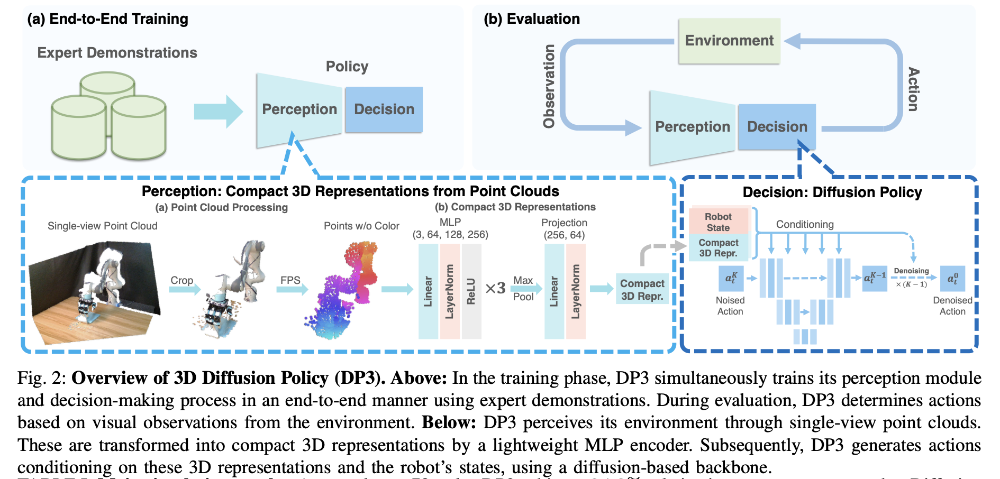

# DP3

## 3 Method

DP3由两个关键部分组成：

1. **感知**。DP3 利用点云数据感知环境，并通过高效的点编码器处理这些视觉观测，生成视觉特征.
    细节：
    1. 仅使用**单视角相机**进行所有任务的策略学习，这样更实用
    2. 使用**稀疏点云**作为 3D 表示。实验表明这个比RGB-D、深度和体素等其他显式表示效率更高。具体方法是在sim/real中都从单个相机获取大小为 84x84 的深度图像，然后利用相机外参和内参将深度转换为点云——不使用颜色通道是为了实现更好的外观泛化
    3. **点云处理。** 由于从深度转换而来的点云可能包含冗余点，例如来自桌子和地面的点，我们裁剪掉这些点，只保留边界框内的点。
    4. 用最远点采样 (farthest point sampling, FPS, [42])（而非uniform sampling）让点数减少到512或1024
    5. **将点云编码为紧凑表示。** 然后，我们使用轻量级 MLP 网络将点云编码为紧凑的 3D 表示，如图 2 所示。该网络被称为 **DP3 编码器**
2. **决策**。DP3 利用富有表达力的diffusion policy作为动作生成骨干。

详细流程见下图，一看就能理解。

简单来说，这篇文章从创新上的贡献仅仅只是把原始的DP以图片为输入改成了以点云为输入；在工程上的贡献也仅仅只是在DP的codebase上添加了多种环境，让codebase更好用，作为这个领域更合适的baseline。但是看论文的贡献也不仅仅能看其创新点，他的最重要的贡献在于解决了领域内长期没解决的一个问题——之前没有方法能work地端到端训练一个imitation policy，要求policy能直接输入三维点云，直接输出action。这篇工作一出来，这个任务就有baseline了，可以让别人能够做follow up。
