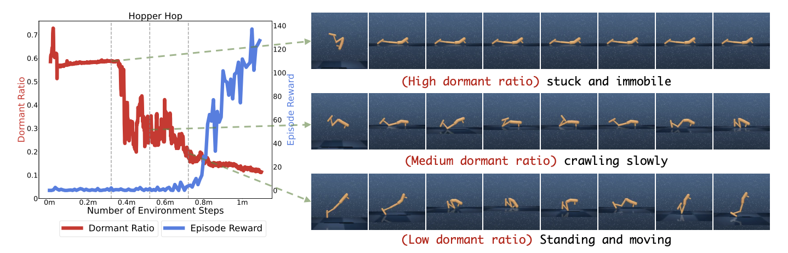

# [DrM：通过最小化休眠率提升视觉RL](https://arxiv.org/abs/2310.19668)

## 0 Abstract

背景：视觉强化学习 (Vision RL) 在连续控制任务中展现出巨大潜力。

困难：目前的 Vision RL 算法在性能的各个方面，如**样本效率、渐近性能**以及它们对**随机种子选择的鲁棒性**方面，仍然不尽如人意。

困难核心原因：智能体在早期训练中经常表现出**持续的不活跃性**，从而限制了它们有效探索的能力。

作者揭示了：智能体**不积极探索的倾向**与**其策略网络中缺乏激活数量足够的神经元**之间存在显著关联。

## 2 Preliminary

Visual reinforcement learning的formulation就是普通的RL，除了输入有图像。由于输入中有图像，这让Vision RL多数是部分可观测问题，因而我们解决的问题多数是**部分可观测马尔可夫决策过程 (POMDP)** 。

Dormant Ratio of Neural Network 休眠神经元的概念最初由 Sokar et al. (2023) 提出，它旨在识别那些**几乎不活跃、显示出最低激活水平的神经元**。这个概念在分析神经网络行为时很重要，因为在线强化学习中使用的网络很容易失去其表达能力。

:::note[定义2.1 (Sokar et al., 2023)]
考虑一个包含总共 $N^l$ 个神经元的全连接层 $l$。给定一个输入分布 $D$，令 $h_i^l(x)$ 表示神经元 $i$ 在输入 $x\in D$ 下在层 $l$ 的输出。第 $l$ 层的第 $i$ 个神经元的分数为（$i \in \{1, 2, ..., N^l\}$）：
$$
s_i^l = \frac{E_{x\in D}|h_i^l(x)|}{\frac{1}{N^l} \sum_{k\in l}E_{x\in D}|h_k^l(x)|}
$$
如果 $s_i^l \le \tau$ ，我们就定义层 $l$ 中的神经元 $i$ 为 $\tau$-休眠神经元。
:::

上式解释：$s_i^l$表示这一层的第i个神经元的“利用率”，并且有
$$
\sum_{i\in l} s_i^l = N^l
$$

:::note[定义2.2]
对于一个全连接层$l$, 我们用 $H_l^\tau$ 表示 $\tau$-休眠神经元的数量。神经网络 $\phi$ 的  $\tau$-休眠率可以定义为：
$$
\beta_\tau = \frac{\sum_{l \in \phi} H_\tau^l}{\sum_{l\in \phi}N^l}
$$
:::

上式解释：$\phi$ 有很多层，$l$ 表示层数。$H_l^\tau$表示第 $l$ 层到底有多少神经元其实没用，$N^l$ 表示第 $l$ 层神经元总个数。不难看出，上式分子是神经网络 $\phi$ 中所有没用的神经元总个数，分母是神经网络 $\phi$ 中所有神经元总个数，即 $\beta_\tau$ 是没用神经元比例。显然， $\tau$ 越大，$\beta_\tau$ 越大。

## 3 Method

#### 3.1 关键见解：休眠率与行为多样性

这篇文章的想法来源于实验中的一个发现：智能体休眠率的急剧下降 与 智能体在visual continuous control tasks中技能的获取 之间存在关联。

实验：作者用DrQ-v2（一种直接从像素观测中学习的无模型强化学习算法）在DeepMind Control Suite 的 Hopper Hop 任务训练过程中学习到的行为作为示例，如下图所示：智能体策略网络中休眠率的急剧下降是智能体执行有意义探索行为的**内在指标**。即，当休眠率高时，智能体通常固定不动，做不出有意义的动作；当比例降低了，说明智能体开始尝试有意义地探索，这时智能体逐渐学会爬行，到站立，最终跳跃。

图2: (DrQ-v2 智能体在 Hopper Hop 任务中前 100 万帧训练期间的休眠率): 作者发现随着休眠率的下降，智能体逐渐获得了行动能力。尽管在此阶段奖励保持最低，但休眠率比奖励更能提供智能体初始学习进度的深刻衡量。

实验结论：**休眠率的下降与智能体开始有意义的行动密切相关**，标志着其脱离了先前单调或随机的行为。这种转变可以在**没有相应奖励增加**的情况下发生，这表明休眠率是一种内在指标，它更多受到智能体行为多样性和相关性的影响，而非其获得的奖励。

受以上实验启发，作者尝试利用休眠率作为平衡 exploration 和 exploitation 的关键工具。许多现有策略根据**静态因素**（如任务复杂度和训练阶段）调整探索噪声，然而，智能体的性能可能因任务和不同的初始化而波动，仅基于这些静态因素进行调整效率较低，并且通常需要**大量针对特定任务的超参数微调**。相比之下，根据智能体当前的性能**定制探索噪声**提供了一种更灵活有效的方法。
比较：一种直观的方法是依赖奖励信号，但这种策略带来了以下挑战：

1. 奖励值定义因不同任务和领域而异，需要领域特定知识进行解释和超参数调整。
2. 在特定任务中，奖励无法完全指示智能体的潜在学习阶段。如上图所示，无论智能体是否掌握了运动或仍然停滞不前，它都可以获得差不多的奖励。

因此，**休眠率**作为调整探索与利用权衡的更有效指标出现，因为它忠实地反映了智能体行为的动态变化。鉴于此，作者设计出DrM算法，其核心是“较高的休眠率表明需要增加 exploration，而较低的休眠率则需要 exploitation”。

#### 3.2 DrM：通过最小化休眠率实现视觉强化学习

为了积极促进神经网络向降低其休眠率的方向演化，作者提出了三种机制：

1. 休眠率引导的扰动 (Dormant-ratio-guided perturbation)
    目标：当强化学习智能体网络显示高休眠率、失去表达能力时，**主动扰动模型权重**。
    方法：**扰动重置方法** (D’Oro et al., 2023; Ash & Adams, 2020)，采用软重置，即将智能体所有参数在其先前值和随机初始化值之间进行插值：
    $$
    \theta_t = \alpha \theta_{t-1} + (1-\alpha) \phi, \qquad\text{where } \phi\sim \text{initializer}
    $$
    这里 $\alpha$ 是扰动因子，$\theta_{t-1}$ 是重置前的网络权重，$\theta_{t}$ 是重置后的网络权重，$\phi$ 是随机初始化的权重。$\alpha$ 的值由休眠率 $\beta$ 控制：
    $$
    \alpha = \text{clip}(1-k\beta, \alpha_\text{min}, \alpha_\text{max})
    $$
    其中 $k$ 是扰动率。（简单想想，休眠率很小说明）
    对比：这里的方法和NoisyNet (Fortunato et al., 2018b) 的方法有根本的不同，NoisyNet旨在通过在每个时间步向模型权重注入噪声来鼓励探索，但这里是受控随机

2. 唤醒探索调度器 (Awaken exploration scheduler)
    目标：在休眠率高时强调以大的探索噪声进行探索，并在休眠率低时减少探索噪声。
    作者没有使用原始 DrQ-v2 中线性衰减的探索噪声方差调度方法，而是引入了**基于休眠率的唤醒探索调度器**。具体来说，令 $\hat\beta$ 表示一个低休眠率阈值。当智能体的休眠率低于 $\hat\beta$ 时，我们将其定义为“已唤醒”。令 $t_0$ 为智能体从训练开始到“被唤醒”所需的时间步数。探索噪声的标准差 $\sigma(t)$ 定义为：
    $$
    \sigma(t) = \begin{cases}\max\left(\frac{1}{1+\exp(-(\beta-\hat\beta)/T)}, \sigma_\text{linear}(t-t_0)\right)\qquad&\text{if awakened}\\ \frac{1}{1+\exp(-(\beta-\hat\beta)/T)}\qquad&\text{otherwise} \end{cases}
    $$
    其中 $T$ 是探索温度超参数.

3. 休眠率引导的利用 (Dormant-ratio-guided exploitation)
    目标：引入一种在休眠率较低时巧妙地优先考虑利用的机制。
    对于使用 Actor-Critic 算法的连续控制任务，critic的目标是近似$r(s, a)+\gamma Q(s', \pi(s'))$, 但在训练早期，$\pi$ 是次优的且 $Q$ 经常被低估。因此，Ji et al. (2023) 建议使用分位数回归(expectile regression)近似 Q 值的高分位数(high expectile of Q), 使新 target value 为：
    $$
    r(s, a) + \gamma [\lambda V(s') + (1-\lambda) Q(s', \pi(s'))], \qquad \lambda\in [0, 1]
    $$
    由于 $V$ 比 $Q$ 值收敛更快，这种机制允许强化学习智能体快速利用其历史上成功的轨迹，而不会引入额外的过高估计。上式中 $\lambda$ 可以作为 exploitation 超参数， $\lambda$ 越高意味着拟合的 $V$ 函数侧重于从历史经验中（$V(s')$ 包含了历史的更多信息）获取更多价值。
    在此框架下，作者将 $\lambda$ 参数变成 $\beta$ 的函数：
    $$
    \lambda(\beta) = \lambda \frac{1}{1+ \exp((\beta - \hat\beta)/T')}
    $$
    其中 $\lambda$ 是最大 exploitation 超参数，$T'$ 是 exploitation 温度超参数，$\beta$ 和 $\hat\beta$ 分别代表休眠率及其阈值。
    $(8)$ 式解释：当智能体的休眠率超过阈值 $\hat\beta$ 时，选择较低的 $\lambda$ 以强调探索，反之亦然。
