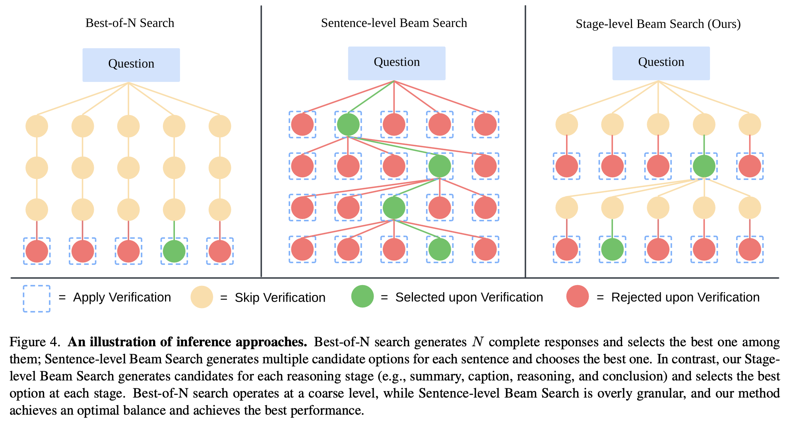
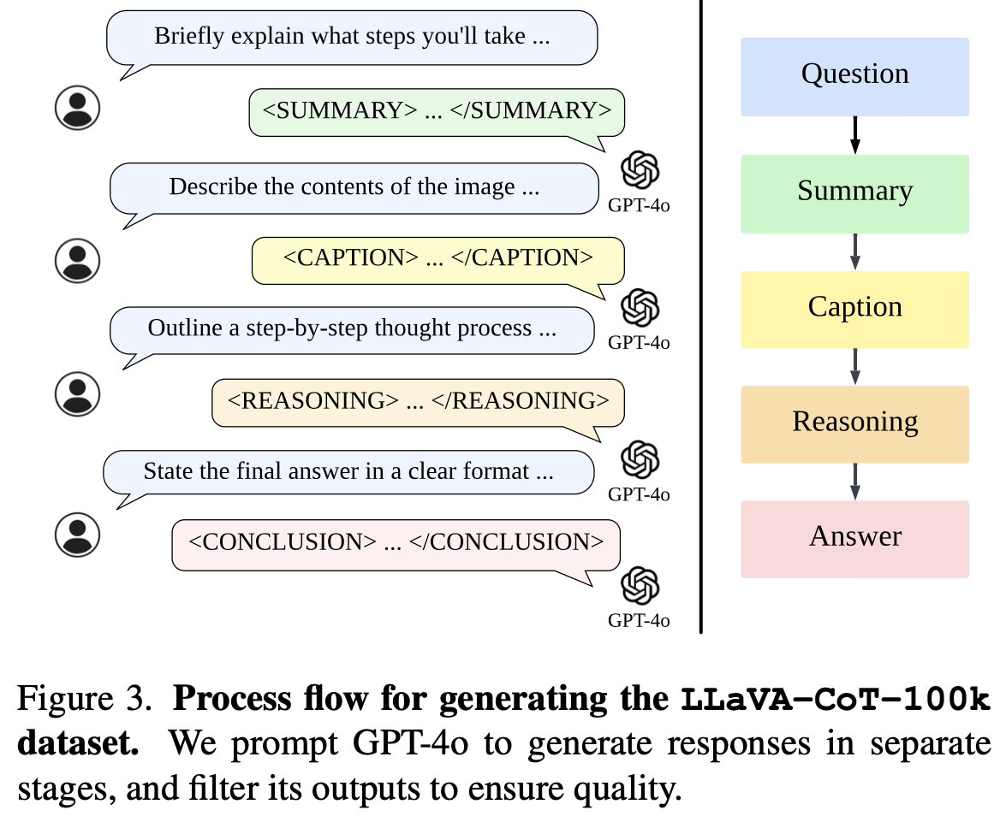

两个创新点：

1. 构建了数据集LLaVA-CoT-100k
2. 提出了inference-time stage-level beam search方法，见下图：
    
    注：其中的一个stage指下面创建数据集细节中说的四种stage的任意一种。显然，一个stage，例如Summary Stage，会包括很多句话，所以细粒度比sentense要上一个层次。

作者用这两种方法在LLaVA基础上训练出了一个LLaVA-CoT模型，性能比许多闭源模型都好（在当时）。

方法其实很简单，创建数据集和inference-time stage-level beam search都是通过 GPT-4o + prompt engineering 实现的。

创建数据集的细节：创建的数据集希望能够更好让模型适合推理，具体来说数据集生成时有四种stage（注：原始数据集包括一张图片、一个问题和答案，我们希望获得更适合模型做推理的LLaVA-CoT数据集）：

1. Summary Stage：对问题进行high-level的总结
2. Caption Stage：当有图片输入时对图片中的每个与问题相关的物体都进行简洁地描述
3. Reasoning Stage：根据上面两个stage的输出结果进行思考
4. Conclusion Stage：根据上面三个stage的输出结果生成用户要求的答案

这个数据集的构造完全是通过prompt engineering实现的，最终得到了100k个高质量问答数据，既有General VQA，又有Science-Targeted VQA。

inference-time stage-level beam search细节：

1. 每次都是两两比较（因为LLM可能只在两两之间比较好坏的情况下正确率比较高，你给LLM 10个stage的回答，让他直接输出哪个回答最好可能正确率不高），假设beam数为N，则一共要比较N-1次，每次比较去掉一个较差的回答。
2. 之前也说过了，按照stage为单位进行beam search。

评价：想法简单，效果不错。但在我看来方法全都是prompt engineering还是有点难绷
