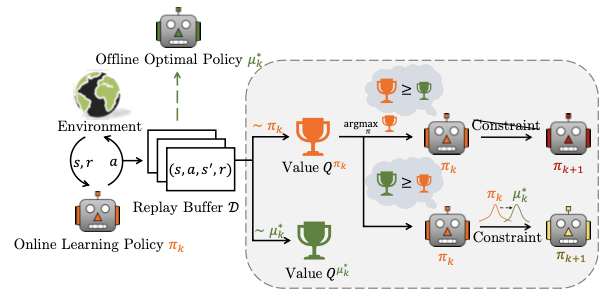
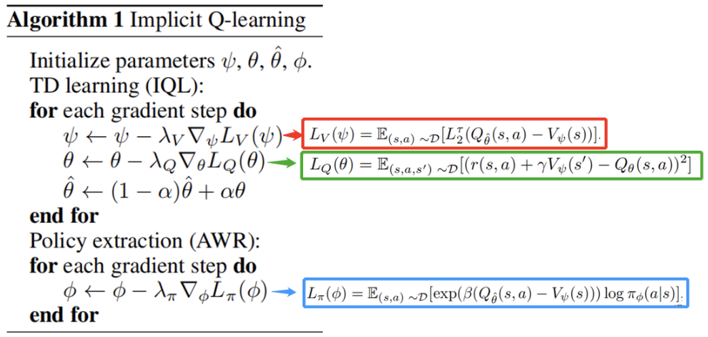
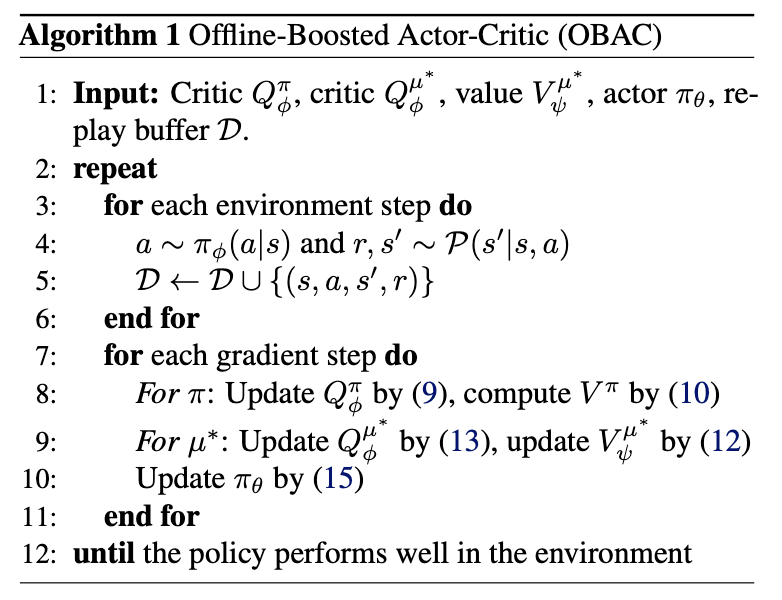

# OBAC: Offline-Boosted Actor-Critic: Adaptively Blending Optimal Historical Behaviors in Deep Off-Policy RL

这篇文章主要是提出了一种Actor-Critic算法的变种，其核心是通过在 replay buffer 的数据上训练一个 offline policy, 并利用这个 offline policy 的信息改进 Online Learning Policy。

模型架构：

作者认为，现有 RL 算法性能不高的重要原因是 insufficient data utilization，之前的解决这个问题的方法自身也有各种局限性。

作者做了如下小实验，从而想到了这篇论文的思路。作者弄了三种学习算法进行比较：

1. 纯离策略智能体 (Pure off-policy agent)：用1M步的环境交互训练一个 **Soft Actor-Critic (SAC)** (在线)智能体，在每个时间步，新数据都会累积到一个专门的回放缓冲区 $D_\text{SAC}$ 中，用于更新在线学习策略。

2. 并行离线智能体 (Concurrent offline agent)：直接利用训练 SAC 智能体时从环境中交互得到的动态增长的 replay buffer 中的数据以及Implicit Q-Learning (IQL，一种离线强化学习算法) 算法学习离线最优策略，称为 IQL Concurrent。注意，IQL Concurrent 智能体在整个训练过程中不与环境进行交互，只利用SAC的数据来训练。

    > 插一句 IQL 的原理：
    >
    > 
    >
    > IQL算法核心目标是得到一种不需要访问或估计数据中从没见过的action的value的 Offline RL method 。为了实现这一点，作者用了几种特别的技术：
    >
    > 1. 修改 Offline RL 的 TD target（去掉max）
    > 2. Expectile Regression 代替通常的 MSE loss（反正实验证明好用一些，并且MSE其实就是Expectile Regression的$\tau = 0.5$时的特殊情况）
    > 3. 用 AWR 方法 Extract Policy
    >
    > 其他细节不重要。

3. 在线训练离线智能体 (Online-training offline agent)：这时IQL agent会与环境进行交互。

结果：IQL Concurrent 可能比 SAC 更好，这说明可能可以通过结合这两者让整体policy性能更好。

算法：

其中$(9)$式用于学习 $Q_\phi^\pi$: 
$$
\arg\min_{Q^\pi_\phi}\mathbb E_{(s, a, r, s')\sim D} \left[\frac 12 (Q^\pi_\phi(s, a)-T^\pi Q^\pi_\phi(s, a))^2\right]
$$
$(10)$式用于得到 $V^\pi$: 
$$
V^\pi (s) = \mathbb E_{a\sim \pi} [Q^\pi_\phi(s, a)]
$$
$(11)$: 其中 $\mu_k^* = \arg\max_{a\sim D}Q^{\mu_k}(s, a)$ 是offline optimal policy, $T^{\mu_k^*}$ 是 修改后的Bellman Expectation Operator(修改的目的是之后消除评估步骤中对 $\mu_k^*$ 的要求)
$$
T^{\mu_k^*} Q_\phi^{\mu_k^*}(s, a) = r(s, a) + \gamma \mathbb E_{s', a'\sim \mu_k^*}\left[Q_\phi^{\mu_k^*}(s', a')\right] = r(s, a) + \gamma \mathbb E_{s'}\left[\max_{a'\sim D} Q_\phi^{\mu_k^*}(s', a')\right]
$$
$(12)$: 有一些方法可以不用显示要求得到 $\mu_k^*$ 就能处理$(11)$式中的 $\max$ 算子，例如IQL中用的expectile regression方法，可以得到$Q^{\mu^*}(s, a)$ 和 $V^{\mu_k^*}(s)$：(这里的处理与$(9)$式不同的原因就是为了处理 $\mu_k^*$ )
$$
\arg \min_{V_\psi^{\mu^*}} \mathbb E_{(s, a)\sim D}\left[L_2^\tau(Q_\phi^{\mu^*}(s, a)-V_\phi^{\mu_k^*}(s))\right]
$$
其中 $L_2^\tau(x) - \left|\tau - \mathbb 1(x<0)\right| x^2$ 是 expectile regression function，$\tau$ 是 expectile factor；

$(13)$:
$$
\arg\min_{Q_\phi^{\mu^*}}\mathbb E_{(s, a, s', r)\sim D}\left[ \frac 12 \left( r + \gamma V_\psi^{\mu^*}(s') - Q_\phi^{\mu^*}(s, a) \right)^2 \right]
$$
作者还采取了Clipped Double Q-technique，这可以提高稳定性、减轻overestimate。

以上几个式子都用于策略评估，下面考虑如何进行策略改进。

从最原始的角度想，策略改进应该这样做：
$$
\pi_{k+1} = \arg\max_\pi \mathbb E_{a\sim \pi}[Q^{\pi_k}(s, a)]
$$

$$
\text{s.t.}\ \int_{a\in A} f\left( \frac{\pi(a\mid s)}{\mu_k^*(a\mid s)}\right)\mathbb 1(V^{\mu_k^*}(s) - V^{\pi_k}(s))\mu_k^*(a\mid s)da \le \epsilon
$$

$$
\int_{a\in A} \pi(a\mid s)da = 1,\ \forall s\in D
$$

原论文 $(15)$ 式的推导我没太理解怎么得到的，总之是一种更新 $\pi$ 的方式吧...

总结：原始的推导我都能理解，都是正常的policy evaluation（用TD方法）和policy improvement（取Q函数关于action的argmax），之后唯一的变化是为了引入离线信息 $\mu_k^*$ 所以在策略改进的时候修改了一下，变成一个constrain 优化问题。这个优化问题有闭式解，但需要显示用到 $\mu_k^*$ ，这实际上得不到，所以用一种方法把显示依赖转成隐式依赖。就这个思路。
