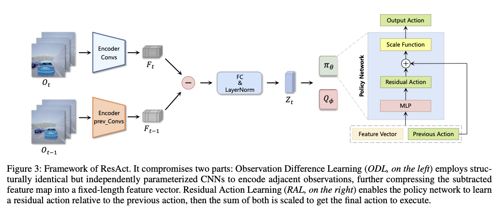
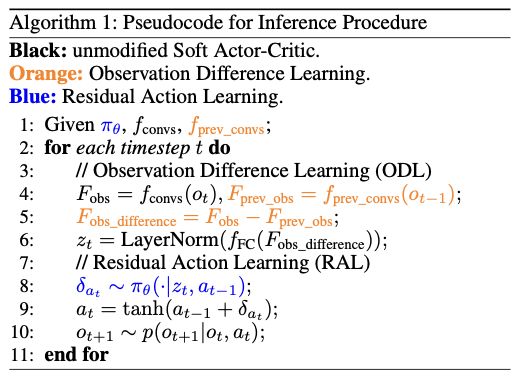

# [ResAct: Visual Reinforcement Learning with Residual Action](https://ojs.aaai.org/index.php/AAAI/article/view/34097/36252)

这篇思路很简单，作者声称让 RL 领域中的 policy 不要直接输出action，输出相对上一次 action 的 residual action 可能更容易让policy学习，核心思路和ResNet类似。

模型架构图：

细节只有一个：作者设计的policy在输入时会输入上一时间的action，并且在Network架构设计时，由于作者认为引起action变化的因素主要是observation的变化，因此作者让t时刻的obs和t-1时刻的obs之间先分别提取出feature map，然后相减，认为这其中应该包含了所有res act需要的信息。

伪代码：

看模型架构图和伪代码完全足够理解论文的核心了。
