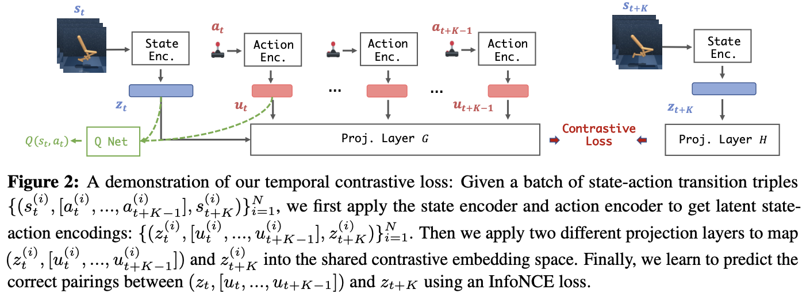
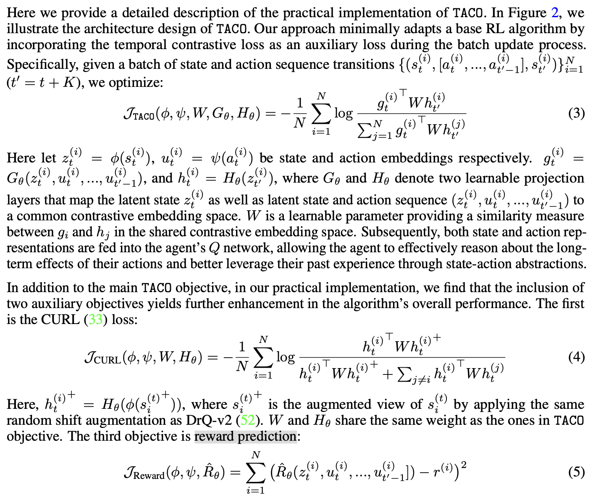

核心：提出了一种时间和动作驱动的对比学习方法，让agent能更好学会latent state and action representations，从而能在这个较好的representations基础上学optimal policy or value function，提高sample efficiency.

## 2 Preliminaries

在Visual RL领域，observation是pixel，所以我们需要首先将原始图片经encoder转换为representation，然后传给策略，这要求我们训练时同时学习encoder和policy/value function。作者认为这样训练得到的encoder大概质量不太行，不能真正捕捉图片中的关键信息。

## 3 TACO: temporal action-driven contrastive Loss

#### 3.1 Temporal contrastive learning objectives and analysis

目标：学会的state and action representations能够囊括essential information about the environment’s dynamics sufficient for learning the optimal policy。作者声称，只有state and action representations学的够好，agent才能从这个representations中得到有关state和action的concise and expressive understanding。

设 $S_t, A_t$ 是时间 $t$ 时的状态和动作，对应的representation是 $Z_t = \phi(S_t)$, $U_t = \psi(A_t)$. 定义loss为：
$$
\mathbb J_\text{TACO}(\phi, \psi) = I(Z_{t+K};[Z_t, U_t, \cdots, U_{t+K-1}])
$$
其中 $I$ 表示互信息，$K$ 是一个固定的超参数。解释：互信息 $I(X;Y)$ 衡量的是**给定 $Y$ 之后，我们对 $X$ 的不确定性减少了多少**，即 $Y$ 包含了多少关于 $X$ 的信息。在这里，如果给定当前状态 + 一段未来动作序列，我可以很好地预测 $Z_{t+K}$，说明我对系统动力学理解地较准确。训练时通过最大化这个互信息，鼓励encoder学习对未来敏感的潜在状态表征。

细节：实际学习时是用 InfoNCE loss 来估计 $\mathbb J_\text{TACO}(\phi, \psi)$ 的lower bound实现的学习。

一个理论保证：

Theorem 3.1: 设 $K\in \mathbb N^+$, $\mathbb J_\text{TACO}(\phi, \psi) = I(Z_{t+K};[Z_t, U_t, \cdots, U_{t+K-1}])$. 若优化后得到的 $\phi$, $\psi$ 使 $\mathbb J_\text{TACO}(\phi, \psi)$ 达到最大值，那么对任意两个状态-动作对 $(s_1, a_1), (s_2, a_2)$，只要 $\phi(s_1) = \phi(s_2)$, $\psi(a_1) = \psi(a_2)$，就有
$$
Q^*(s_1, a_1) = Q^*(s_2, a_2)
$$
解释：上述定理说明，如果我们的 TACO objective 最大化了，那么我们得到的两个encoder $\phi, \psi$ are sufficient for making optimal decisions（我有点感觉这个定理是硬生生搬过来的，说明了一些事情，但不关键）。

#### 3.2 TACO implementation

细节：

1. 在将 raw state 和 action 经过 encoder 得到 representation 之后，作者分别用两个 projection layer 将两个需要对比的项 ($z_t, u_t, \cdots, u_{t+K-1}$ and $z_{t+K}$) 投影到共同的比较空间中，然后用对比学习标准方法构造loss，如下图 $J_\text{TACO}$ 项所示。
2. 作者发现额外添加两个另外的loss对最终性能也有提升，分别是 CURL loss 和 reward prediction loss。作者没解释为什么能提升，反正实验上证明比较有效。
    （多嘴：我发现在visual RL领域3是个神奇的数字，什么东西都要弄3个，例如DrM中针对dormant ratio更快下降提出了三种改进方法，ACE的伪代码中单独分出3个模块，这里本来主打第一个loss效果好的为了凑成3还要弄两个辅助loss上去）

具体loss表达式见以下图片。

